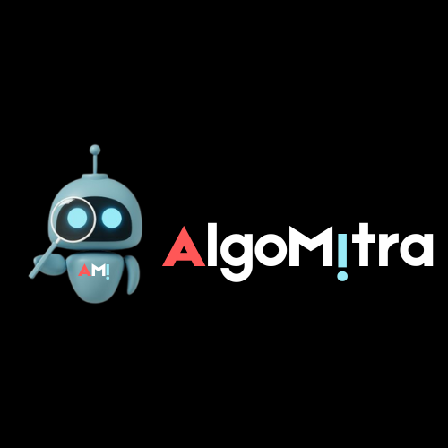

# AlgoMitra

 <!-- Placeholder for a real logo image -->


## 🌟 Introduction

**AlgoMitra** is an interactive educational web application designed to demystify complex algorithms through engaging visualizations. Built with **Next.js** and **TypeScript**, this tool empowers users to explore a wide variety of algorithms—ranging from basic sorting and searching techniques to advanced graph traversal and dynamic programming strategies. With its intuitive user interface powered by **NextUI**, learning algorithms has never been more accessible or enjoyable.

---

## 🚀 Overview

AlgoMitra provides comprehensive visualizations for an array of algorithms, facilitating a hands-on learning experience:

- **Sorting Algorithms**: Start with Bubble Sort, with plans to implement Quick Sort, Merge Sort, Heap Sort, and more.
- **Searching Algorithms**: Explore both Binary and Linear Search methods.
- **Graph Traversal**: Upcoming features include BFS, DFS, Dijkstra’s, and Kruskal’s algorithms.
- **Dynamic Programming & OS Algorithms**: Initial support for Fibonacci, Knapsack, and CPU scheduling algorithms (e.g., Round Robin, FCFS).

AlgoMitra aims to simplify the learning process by allowing users to visually interact with the mechanics behind each algorithm.

## 🌟 Features

- **Interactive Algorithm Visualizations**:
  - Sorting Algorithms: Currently featuring Bubble Sort.
  - Searching Algorithms: Visualize Binary and Linear Searches.
  - Graph Algorithms: Placeholder support for DFS, BFS, Dijkstra, and Kruskal.
  - OS & Dynamic Programming: Initial implementations for scheduling and memory algorithms.
  
- **User-Friendly Controls**:
  - Easy-to-use controls for selecting algorithms, generating random arrays, and adjusting visualization speed.

- **Responsive and Intuitive UI**:
  - Built with NextUI for a seamless user experience, including theme switching.

- **Modular Design**:
  - Organized code structure with separate components for each algorithm, promoting clarity and reusability.

## 🛠️ Tech Stack

AlgoMitra is developed using the following technologies:

[](https://nextjs.org/) &nbsp;
[](https://www.typescriptlang.org/) &nbsp;
[](https://react.dev/) &nbsp;
[](https://developer.mozilla.org/en-US/docs/Web/CSS)

---

## 📅 Stage 1 Implementation Plan

### Upcoming Algorithm Implementations

- **Sorting Algorithms**: 
  - Add Quick Sort, Merge Sort, Heap Sort, and expand to support a total of 11 sorting methods.
  
- **Searching Algorithms**:
  - Introduce advanced searching techniques such as DFS, BFS, Jump Search, Interpolation Search, A*, and Greedy Search.

- **Operating System Algorithms**:
  - **CPU Scheduling**: Implement various methods including FCFS, SJF, Priority Scheduling, and Round Robin.
  - **Memory Management**: Develop Paging, Segmentation, and Page Replacement algorithms (FIFO, LRU).
  - **Disk Scheduling**: Integrate FCFS, SSTF, SCAN, C-SCAN, LOOK, and C-LOOK algorithms.
  - **Deadlock Handling**: Include the Banker’s Algorithm, Wait-Die, and Wound-Wait schemes.
  - **File System Management**: Develop algorithms for contiguous and indexed file allocation.

## 🎨 User Interface & Navigation

The UI of AlgoMitra is designed for a user-friendly experience:

- **Responsive Layout**: The application adapts to various screen sizes for optimal usage across devices.
- **Control Panel**: Features dropdowns for algorithm selection, sliders for speed adjustments, and buttons for generating arrays.
- **Modular Components**: Each algorithm type has dedicated components to enhance code clarity and user experience.

## 🚧 Future Enhancements

1. **3D Visualizations**: Plans to incorporate 3D renderings for enhanced user engagement and interaction.
2. **Dedicated Routes**: Establish separate routes for each algorithm category to improve navigation.
3. **User-Defined Inputs**: Allow users to customize array lengths and values for a more interactive experience.
4. **Real-time Complexity Analysis**: Provide live feedback on time and space complexity during visualizations.
5. **Testing & Optimization**: Ensure accurate and efficient visualizations for each algorithm through rigorous testing.

---

## 🎯 Goal

The primary goal of **AlgoMitra** is to make algorithm learning not only accessible but also engaging. By enabling users to visualize the inner workings of algorithms, we strive to transform theoretical concepts into practical understanding.

---

## 🏁 Get Started

Ready to dive in? Clone this repository and start visualizing algorithms with **AlgoMitra**!

### Clone the Repository

```bash
git clone https://github.com/codernotme/AlgoMitra.git
```

### Install Dependencies

```bash
cd AlgoMitra
npm install
```

### Start the Development Server

```bash
npm run dev
```

You’re all set to explore and visualize algorithms with **AlgoMitra**!

---

 <!-- Placeholder for a real screenshot -->

**AlgoMitra** © 2024
